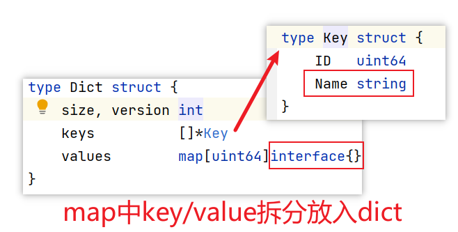

# go-dict

原始仓库地址：<https://github.com/srfrog/dict>

*Python dictionary data type (dict) in Go*

Go 实现 python dict 数据类型

Package dict is a Go implementation of Python [dict][1], which are hashable object maps.
Dictionaries complement Go map and slice types to provide a simple interface to
store and access key-value data with relatively fast performance at the cost of extra
memory. This is done by using the features of both maps and slices.

## 安装指引

Install using "go get":

	go get github.com/srfrog/dict

Then import from your source:

	import "github.com/srfrog/dict"

View [example_test.go][2] for an extended example of basic usage and features.

## 特性

- [x] Initialize a new dict with scalars, slices, maps, channels and other dictionaries.
- [x] Go types int, uint, float, string and fmt.Stringer are hashable for dict keys.
- [x] Go map keys are used for dict keys if they are hashable.
- [x] Dict items are sorted in their insertion order, unlike Go maps.
- [ ] Go routine safe with minimal mutex locking (WIP)
- [x] Builtin JSON support for marshalling and unmarshalling
- [ ] sql.Scanner support via optional sub-package (WIP)
- [ ] Plenty of tests and examples to get you started quickly (WIP)

## 文档

The full code documentation is located at GoDoc:

[http://godoc.org/github.com/srfrog/dict](http://godoc.org/github.com/srfrog/dict)

The source code is thoroughly commented, have a look.

## 最简单的使用方式

Minimal example showing basic usage:

```go
package main

import (
	"fmt"

	"github.com/srfrog/dict"
)

type Car struct {
	Model, BrandID string
	Recalls        int
}

func main() {
	// Map of car models, indexed by VIN.
	// Data source: NHTSA.gov
	vins := map[string]*Car{
		"2C3KA43R08H129584": &Car{
			Model:   "2008 CHRYSLER 300",
			BrandID: "ACB9976A-DB5F-4D57-B9A8-9F5C53D87C7C",
			Recalls: 1,
		},
		"1N6AD07U78C416152": &Car{
			Model:   "2008 NISSAN FRONTIER SE-V6 RWD",
			BrandID: "003096EE-C8FC-4C2F-ADEF-406F86C1F70B",
			Recalls: 5,
		},
		"WDDGF8AB8EA940372": &Car{
			Model:   "2014 Mercedes-Benz C300W4",
			BrandID: "57B7B707-4357-4306-9FD6-1EDCA43CF77B",
			Recalls: 4,
		},
	}

	// Create new dict and initialize with vins map.
	d := dict.New(vins)

	// Add a couple more VINs.
	d.Set("1N4AL2AP4BN404580", &Car{
		Model:   "2011 NISSAN ALTIMA 2.5 S CVT",
		BrandID: "003096EE-C8FC-4C2F-ADEF-406F86C1F70B",
		Recalls: 2,
	})
	d.Set("4T1BE46K48U762452", &Car{
		Model:   "2008 TOYOTA Camry",
		BrandID: "C5764FE4-F1E8-46BE-AFC6-A2FC90110387",
		Recalls: 5,
	})

	// Check current total
	fmt.Println("Total VIN Count:", d.Len())

	// Print VINs that have 3 or more recalls
	// func (d *Dict) Items() <-chan Item
	for item := range d.Items() {
		car, ok := item.Value.(*Car)
		if !ok {
			continue // Not a Car
		}
		if car.Recalls < 3 {
			continue // Not enough recalls
		}
		fmt.Println("---")
		fmt.Println("VIN:", item.Key)
	}
}
```

## go-dict与python dict对照


| 序号 | 功能                                                                                     | python dictgo-dict                 | go-dict      |
| ---- | ---------------------------------------------------------------------------------------- | ---------------------------------- | ------------ |
| 1    | 删除字典内所有元素                                                                       | dict.clear()                       | dict.Clear() |
| 2    | 返回一个字典的浅复制                                                                     | dict.copy()                        |              |
| 3    | 创建一个新字典，以序列 seq 中元素做字典的键，val 为字典所有键对应的初始值                | dict.fromkeys(seq[, val])          |              |
| 4    | 返回指定键的值，如果值不在字典中返回default值                                            | dict.get(key, default=None)        |              |
| 5    | 如果键在字典dict里返回true，否则返回false                                                | dict.has_key(key)                  |              |
| 6    | 以列表返回可遍历的(键, 值) 元组数组                                                      | dict.items()                       |              |
| 7    | 以列表返回一个字典所有的键                                                               | dict.keys()                        |              |
| 8    | 和get()类似, 但如果键不存在于字典中，将会添加键并将值设为default                         | dict.setdefault(key, default=None) |              |
| 9    | 把字典dict2的键/值对更新到dict里                                                         | dict.update(dict2)                 |              |
| 10   | 以列表返回字典中的所有值                                                                 | dict.values()                      |              |
| 11   | 删除字典给定键 key 所对应的值，返回值为被删除的值。key值必须给出。 否则，返回default值。 | pop(key[,default])                 |              |
| 12   | 返回并删除字典中的最后一对键和值。                                                       | popitem()                          |              |

## 基本原理



* 将map中的key、value拆分放入构造的dict结构中
* 需要反射

## 参考

* <https://docs.python.org/3.7/library/stdtypes.html#mapping-types-dict>
* <https://github.com/srfrog/dict/blob/master/example_test.go>


---
